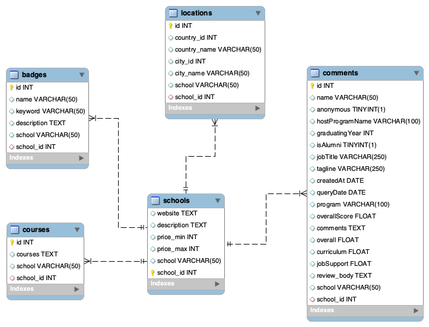

# *SQL Project*

You were hired by Ironhack to perform an Analytics Consulting Project entitled: competitive landscape.

Your mission is to create and populate an appropriate database with many coding schools that are our competition, as well as design an suitable queries that answer business questions of interest (to be defined by you)

TEAM : Jeremy DA SILVA, Javier GUIRAO, Christina CIMINI, Raghda IBRAHIM

# Part 1 : Web scrapping and data preparation

We manually scrapped data for the most commented schools from switchup website. A further improvement would be to scrapp the entire website.

Once the data gathered, some cleaning where needed. First of all it was pure cleaning : removing columns and cleaning the cells. After that, and alongside designing the database, changing the types of some columns in order to fit in the database.

There is also a few aggregation inn the Jupyter notebook that helped us to answer the business question.

# Part 2 : Data base architecture and seeding

We created an SQL schema and 5 different tables which were populated with the data obtained through the web scraping process. To do so, we carefully matched the data types between the SQL tables and the dataframe columns. Also, we added unique IDs to the tables that didn’t have one, and set that column as the primary key.

For the table relationships, we decided to use the school_id as the foreign key for all the tables since it was the common field across them.

The data populating process followed three steps:
  1. Connecting the SQL schema to our Jupyter Notebook using mysql.connector
  2. Storing the dataframe columns in lists
  3. Inserting the data into the SQL tables using the iterrows function

The final ERD looks like this:

# Part 3 : Business answer

As per one of the deliverable of the project, we had to fulfill a data analyst job for Ironhack.
After looking at the data what we can exract for them, we decided to look at where Ironhack is perfoming or not, in order to make improvment and/or take inspiration from the best rated.
And secondly we wanted to look at where Ironhack competitor are not performing in order to advice Ironhack a new bootcamp to develop

# Part 4 : Data visualisation

For this last part, we wanted to visualise on a chart the performances of Ironhack accross all it's bootcamp
